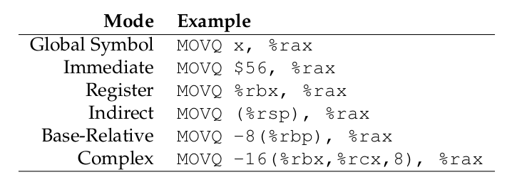
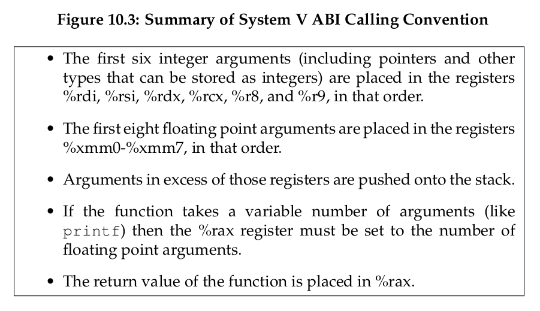
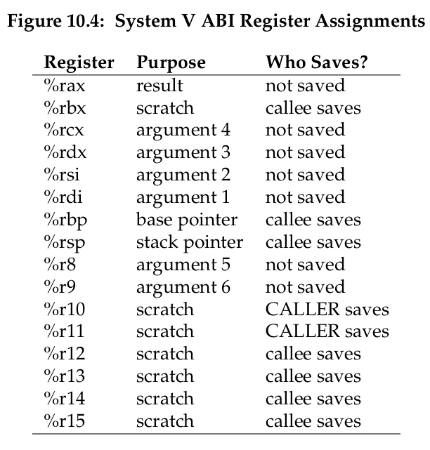
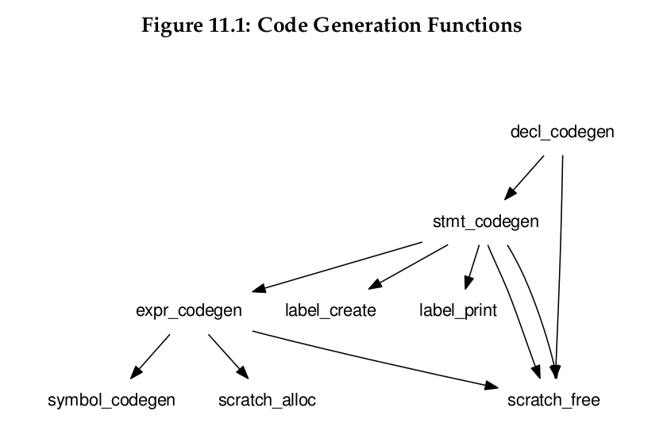
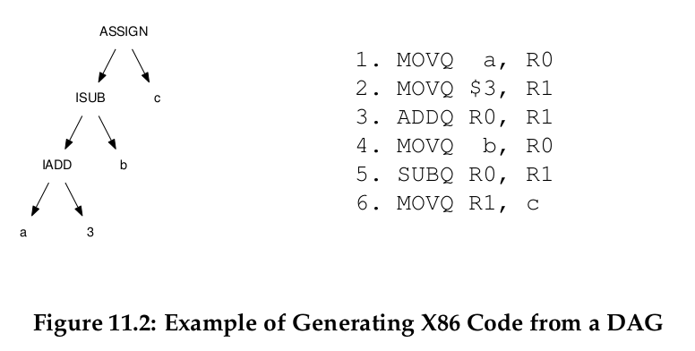
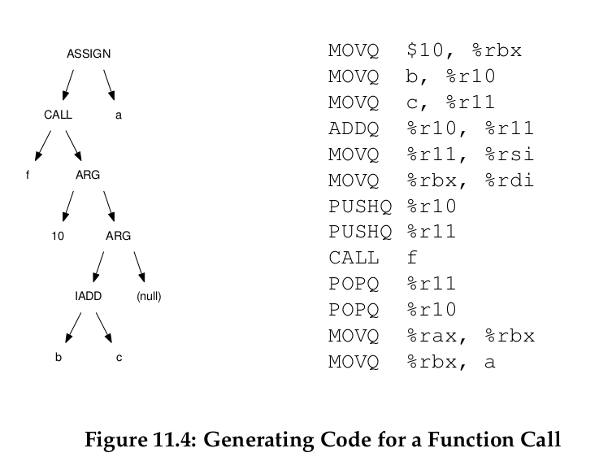
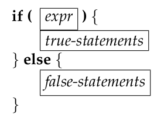
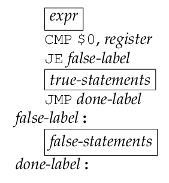
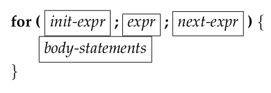
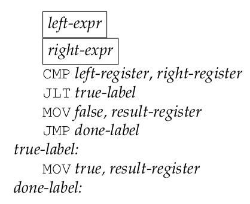

## Chapter 10 汇编语言

### 10.1 介绍

为了构建一个编译器，我们必须至少学习一种汇编语言。当然，再学一些其他的汇编语言也是很有帮助的，这样可以观察一下不同体系结构之间的差异。有一些差异，例如寄存器结构，可能是很重大的差异，而其他的一些差异就仅仅是表面上的差异了。

我们已经观察到很多同学会觉得汇编语言很晦涩而且特别复杂。当然，CPU的完整的手册的确是非常复杂的，描述了成百上千的指令，以及很多晦涩的寻址模式。尽管如此，我们的经验表明只需要学会一种汇编语言的很小的子集（大约30条指令）就可以编写一个基本的编译器。非常多的额外的指令和特性都是用来处理操作系统的一些特殊情况的，例如浮点算术，多媒体计算等等。事实上，我们几乎可以使用最基本的汇编语言的自己来做所有的事情。

我们将会研究当今使用的最常见的两种CPU体系结构：X86和ARM。Intel X86体系结构是一种CISC体系结构，从1970年代的8位体系结构一直发展到了64位体系结构，是当今计算机，笔记本电脑，以及高性能服务器的主流体系结构。而ARM处理器是一种RISC体系结构，从作为个人电脑的32位芯片，一直发展到了64位体系结构，主要使用在低功耗和嵌入式设备上面，例如手机和平板电脑。

本章将为大家介绍这两种体系结构的基础知识，但你需要对这两种体系结构的更多细节有了解。你可以参考《Intel Software Developer Manual》和《ARM Architecture Reference Manual》来获取更多的细节。（注意对两种体系结构的讲解是并行的和自包含的，所以可能会有一些重复内容。）

### 10.2 开源的汇编器工具

一门汇编语言针对相同的CPU，可能有多种方言。这取决于用户使用的汇编器是芯片厂商提供的，还是开源工具。为了保证叙述的一致性，我们使用的方言是GNU编译器和汇编器支持的语法，我们对这两种工具的称谓一般是`gcc`和`as`（有时也叫做`gas`）。

一种比较好的观察汇编器输出的方式是观察一个C程序的输出是什么。为了做到这一点，只需要运行`gcc`命令并附加`-S`标志就行了。这样编译器将会为C程序输出汇编代码文件，而不是二进制的可执行程序。在类UNIX系统上面，汇编代码存储在`.s`后缀的文件中，它表示了“源”文件。

如果你针对下面的程序运行`gcc -S hello.c -o hello.s`：

```c
#include <stdio.h>

int main ( int argc, char *argv[] ) {
  printf("hello %s\n", "world");
  return 0;
}
```

那么你将会看到一个输出文件`hello.s`，类似下面：

```assembly
.file    "test.c"
.data
.LC0:
         .string "hello %s\n"
.LC1
         .string "world"
.text
.global  main
main:
         PUSHQ    %rbp
         MOVQ     %rsp, %rbp
         SUBQ     $16, %rsp
         MOVQ     %rdi, -8(%rbp)
         MOVQ     %rsi, -16(%rbp)
         MOVQ     $.LC0, %rax
         MOVQ     $.LC1, %rsi
         MOVQ     %rax, %rdi
         MOVQ     $0, %rax
         CALL     printf
         MOVQ     $0, %rax
         LEAVE
         RET
```

（有很多种有效的方式来编译`hello.c`程序，所以输出可能会有些不同。）

尽管有各种各样的CPU架构，汇编代码一般来说有三种类型的元素组成：

**伪指令（Directives）**是由一个点开头的，为汇编器、链接器或者调试器提供了有用的结构化的信息，但它们并不是汇编语言指令，所以叫伪指令。例如，`.file`仅仅记录了源文件的文件名，来辅助调试器。`.data`标识了程序的数据段的开始。`.text`标识了程序的代码段的开始。`.string`标识了一个数据段中的字符串常量。`.global main`标识了标签`main`是一个全局标签，可以被其他代码模块访问。

**标签（Labels）**以一个冒号结尾，标识了名字和位置的关系。例如，标签`.LC0`标识了接下来的字符串应该被叫做`.LC0`。标签`main`标识了指令`PUSHQ %rbp`是`main`函数的第一条指令。根据约定，以点开头的标签标识了由编译器产生的临时局部变量，其他符号是用户可见的函数和全局变量。标签并不需要出现在最终的机器代码中，但它们出现在了汇编代码中，是为了链接的需要，以及在最终的可执行文件中，为了调试的需要。

**指令（Instructions）**是真正的汇编代码，例如`PUSHQ %rbp`指令，为了和伪指令以及标签区分开，我们使用大写字母来编写指令，GNU汇编器本身不区分大小写。

为了将`hello.s`转换成一个可执行的程序，只需要执行`gcc`指令，就可以了。因为`gcc`指令会自动识别出汇编程序代码，然后链接到标准库：

```bash
$ gcc hello.s -o hello
$ ./hello
hello world
```

将汇编代码编译成目标代码，本身也是很有趣的。所以可以使用`nm`功能来显示代码中的符号（“名字”）：

```bash
$ gcc hello.s -c -o hello.o
$ nm hello.o
0000000000000000 T main
                 U printf
```

上面展示了链接器所需要的信息。`main`函数出现在了`T`（文本）段中，位置是0，`printf`是未定义的（`U`），所以它必须从标准库中获取。但没有任何像`.LC0`这样的标签出现，因为这些标签并没有声明为`.global`全局标签。

当我们学习汇编语言时，要利用好现有的编译器：编写一些简单的函数，然后看一下`gcc`的输出是什么样子。这样就为我们提供了学习新指令和新技术的起点。

### 10.3 X86汇编语言

X86是一系列微处理器的统称，这些微处理器是从Intel 8088处理器发展而来的，最初使用在原始的IBM电脑上，包括了8086,80286,，386，486等等处理器。每一代的处理器都会增加一些新的指令和寻址方式（从8位到16位到32位），并且处理器是向前兼容的。一些竞争厂商（如AMD）会实现兼容X86指令集的芯片。

尽管如此，Intel在64位这一代处理器打破了传统，引入了全新的品牌（Itanium）和全新的体系结构（IA64），并且没有向前兼容。而是引入了一些全新的概念，例如“很长的指令字”（Very Long Instruction Word，VLIW），在这种概念里面，并行算子被编码成了一个单独的字。这就为程序的提速带来了巨大的潜力，因为指令层的并行执行得到了很大的优化。但和之前的指令集决裂了。

AMD仍然遵循旧的方式生产了一个64位的体系结构（AMD64），并且向前兼容Intel和AMD的芯片。上面的两种方式在技术层面有很多争论，但在市场上，AMD取得了成功。所以Intel也生产了自己的64位的芯片（Intel64），可以兼容AMD64以及Intel的旧版本的芯片。所以X86-64是AMD64和Intel64体系结构的统称。

X86-64是CISC（复杂指令集计算）的一个很好的例子。指令集中有大量的指令以及很多不同的子模式。很多指令都是为了完成很有限的任务而存在的。所以，指令集的一个很小的子集就可以让我们完成大部分的工作了。

#### 10.3.1 寄存器和数据类型

X86-64有16个64位的通用寄存器。


这些寄存器都是几乎通用的，因为早期版本的处理器为上面的每个寄存器都设计了一个特殊的目的，而且并不是所有的指令都能应用到每个寄存器上。上面的16个寄存器中的前8个寄存器的名字就表示了它们最初被设计出来时的目的是什么：例如，`%rax`寄存器用来做为累加器使用。

> AT&T语法和Intel语法的对比
>
> 要注意GNU工具使用的是传统的AT&T汇编语法，这种语法在很多芯片上的类UNIX操作系统中使用。而Intel的汇编语法一般使用在DOS和Windows系统上。下面的指令是AT&T语法：
>
> ```assembly
> MOVQ %RSP, %RBP
> ```
>
> `MOVQ`是指令的名字，百分号表示了`RSP`和`RBP`都是寄存器。在AT&T语法中，source一般是第一个参数，destination是第二个参数。
>
> 在其他地方（比如说Intel手册中），我们将会看到Intel的汇编语法，它去掉了百分号，然后将参数的顺序反转了。例如，同样的指令在Intel语法中是：
>
> ```assembly
> MOVQ RBP, RSP
> ```
>
> 当阅读手册或者文档时，要注意你阅读的是AT&T语法还是Intel语法，只要找百分号就行了！

随着芯片设计的发展，添加了新的指令和寻址模式，使得不同的寄存器功能几乎一样了。一些遗留的指令，比如字符串的处理，需要用到`%rsi`和`%rdi`寄存器。还有，有两个寄存器被用来保存栈指针（stack pointer）和基指针（base pointer），分别是`%rsp`和`%rbp`寄存器。剩下的8个寄存器编了号，也没有特殊的用途了。

体系结构从8位一直发展到了64位，所以每个寄存器都有一些内部结构。`%rax`的低8位是一个8位寄存器`%al`，接下来的8位是`%ah`寄存器。低16位被叫做`%ax`寄存器，低32位被叫做`%eax`寄存器。整个的64位被叫做`%rax`寄存器。


编过号的寄存器`%r8-%r15`也有相同的内部结构，但在名字上有一点区别：


为了让事情尽量简单，我们将会专注在64位的寄存器上面。尽管大部分产品级的编译器都会使用一种混合模式：一个字节（byte）可以表示布尔类型的值，一个长字（long word）可以表示大部分的整数运算。因为大部分的程序不需要大于$2^{32}$的整型数据。一个四字（quadword）可以用来表示内存地址，这样寻址空间就达到了16EB（exa-bytes）的虚拟内存空间。

#### 10.3.2 寻址模式

`MOV`指令会在寄存器之间移动数据，还会使用不同的模式读取内存中的数据或者写入内存。一个单独的字符后缀决定了移动的数据的大小：


`MOVB`移动一个byte，`MOVW`移动一个word，`MOVL`移动一个long，`MOVQ`移动一个quad-word。一般来说，我们所读写的位置的大小必须和后缀相匹配。在某些情况下，我们可以去掉后缀，汇编器可以推测出正确的大小。尽管如此，可能会出现一些无法预期的结果，所以我们需要制定一下使用后缀的约定。

`MOV`指令的参数有以下几种寻址模式。

- **全局值（global value）**通常指一个朴素的名字例如`x`或者`printf`这样子的，汇编器将会把这些名字翻译成一个绝对地址或者一个地址的计算过程。
- **立即数（immediate value）**是一个常数，通常由一个美元符号来标识，例如`$56`，立即数有限定范围，取决于使用的指令。
- **寄存器值**是寄存器的名字，例如`%rbx`。
- **间接值（indirect value）**指的是一个寄存器中保存的内存地址所指向的内存中的值。例如，`(%rsp)`指的是`%rsp`中的地址指向的值。
- **相对基址**的值给定了一个常数并累加到了一个寄存器的名字上面。例如，`-16(%rcx)`表示低于`%rcx`中保存的地址16个字节的地址所指向的内存中的值。这种寻址模式很重要，尤其是在操作栈、局部变量和函数参数的时候。因为一个对象的起始位置会有一个寄存器给定。
- **复合（complex）**地址的形式是：$D(R_A,R_B,C)$，指的是地址在$R_A+R_B*C+D$的内存中的值。$R_A$和$R_B$指的是通用寄存器，而$C$可以是1，2，4或者8，$D$可以是任意整数。这种寻址模式一般用来在数组中索引一个元素，$R_A$是数组的起始地址，$R_B$是数组的索引，$C$给出了数组中元素的类型的大小，$D$是相对于索引元素的偏移量。

下面是一个例子，这个例子使用了各种寻址模式来将一个64位的值加载到`%rax`寄存器中：



对于大部分而言，同样的寻址模式可以用来将数据存储到寄存器中或者内存中相应的地址。但有一些例外存在。例如，不可能给`MOV`指令传两个相对基址的寻址参数：`MOVQ -8(%rbx), -8(%rbx)`。具体什么样的寻址模式的组合方式是合法的，你需要读一下指令集的手册。

在一些情况下，我们可能想将加载变量的地址而不是加载一个值。当处理字符串或者数组时，这些指令很好用。为了这个目的，可以使用`LEA`（load effective address）指令，可以用来执行和`MOV`指令相同的地址计算。


#### 10.3.3 基本算术

我们的编译器需要四种基本算术运算的指令：整数加法，减法，乘法和除法。

`ADD`和`SUB`有两个操作数：一个源操作数和一个破坏性的目标操作数。例如，下面的指令：

```assembly
ADDQ %rbx, %rax
```

将`%rbx`累加到`%rax`上面，然后将结果保存在`%rax`中，也就是说覆盖了之前的值，所以叫做破坏性的。在编程时需要格外小心，这样就不会把我们之后要用到的值不小心破坏东欧啊。例如，我们可以将`c = a+b+b;`翻译如下：

```assembly
MOVQ a, %rax
MOVQ b, %rbx
ADDQ %rbx, %rax
ADDQ %rbx, %rax
MOVQ %rax, c
```

`IMUL`指令有点不同寻常，因为两个64位数的相乘的结果是一个128位的整数。`IMUL`只有一个参数，将这个参数和`%rax`寄存器中的数值相乘，然后将低64位的结果放入`%rax`寄存器中，将高64位的结果放入`%rdx`寄存器中。（这里有点不明显：因为`%rdx`寄存器并没有在指令中出现。）

例如，假设我们要翻译`c = b*(b+a);`，这里`a`，`b`和`c`都是全局整数。下面是一种可能的翻译：

```assembly
MOVQ a, %rax
MOVQ b, %rbx
ADDQ %rbx, %rax
IMULQ %rbx
MOVQ %rax, c
```

`IDIV`指令做的是相同的事情，当然方向是反过来的。它开始于一个128位的整数，低64位位于`%rax`中，高64位位于`%rdx`中，然后除以指令的参数。商保存在`%rax`寄存器中，余数保存在`%rdx`寄存器中。（如果你想实现模的运算，只需要使用`%rdx`中的值就可以了。）

为了实现除法运算，我们必须保证两个寄存器中都是有符号的值。如果被除数正好能以64位的大小来存储，也就是正好能放进`%rax`寄存器中，但却是负数。那么高64位必须都是1（存放在`%rdx`中），这样的128位才是被除数的完整表示（补码）。`CQO`指令专门用来为有符号的`%rax`中的值来服务，也就是为`%rdx`中放入合适的值。

例如，`a`除以`5`可以翻译为如下：

```assembly
MOVQ a, %rax # 将被除数的低64位放入`%rax`寄存器中
CQO          # 对`%rax`进行符号扩展，符号扩展的信息放入`%rdx`中
IDIVQ $5     # `%rdx:%rax`除以5，将结果放入`%rax`寄存器中
```

`INC`和`DEC`指令对寄存器中的值进行破坏性的加一和减一。例如，语句`a = ++b`可以翻译如下：

```assembly
MOVQ b, %rax
INCQ %rax
MOVQ %rax, b
MOVQ %rax, a
```

`AND`、`OR`和`XOR`指令执行了破坏性的位运算。位运算的意思是针对两个操作数中的每一位做运算，然后存储到结果中。所以`AND $0101B $0101B`将会输出结果`$0100B`。`NOT`指令将会翻转操作数中的每一位。例如，在C语言中`c = (a & ~b);`会被翻译成如下：

```assembly
MOVQ a, %rax
MOVQ b, %rbx
NOTQ %rbx
ANDQ %rax, %rbx
MOVQ %rbx, c
```

这里要注意的一点是：指令集并没有实现我们所熟知的C语言当中的逻辑布尔运算（因为存在短路求值）。例如，我们可能将0定义为`false`，而将非0的数据定义为`true`。在这种情况下，`$0001`是`true`，但`NOT $0001B`是`$1110B`，同样是`true`。为了实现正确的布尔逻辑运算，我们需要使用下面将要讲解的`CMP`指令。

就像`MOV`指令一样，各种算术指令都可以使用所有的寻址模式。尽管如此，对于我们的编译器项目而言，使用`MOV`指令读写寄存器，然后只使用寄存器来做算术运算是比较好的实现方式。

#### 10.3.4 比较和跳转

使用`JMP`指令，我们可以创建一个简单的无限循环从零开始数，使用`%rax`寄存器：

```assembly
      MOVQ $0, %rax
loop: INCQ %rax
      JMP loop
```

为了构建更多有用的结构例如可以终结的循环或者`if-then`语句，我们必须有一个机制来求值并改变程序的控制流。在大多数汇编语言中，使用两种类型的指令来实现：比较和跳转。

所有的比较指令都是使用`CMP`指令来实现的。`CMP`比较了两个寄存器中的值的大小，然后在内部的`EFLAGS`寄存器中设置了某些位，来记录两个值是相等的，还是大于或者小于的关系。我们无需直接查看`EFLAGS`寄存器中的值。而是选择使用一些跳转指令，这些指令会检查`EFLAGS`寄存器中的值，然后进行合适的跳转：


例如，下面是一个循环，从0数到5，使用`%rax`寄存器：

```assembly
      MOVQ $0, %rax
loop: INCQ %rax
      CMPQ $5, %rax
      JLE loop
```

下面是一个条件赋值的汇编代码。如果全局变量`x`大于0，那么全局变量`y`赋值为10，否则赋值为20。

```assembly
      MOVQ x, %rax
      CMPQ $0, %rax
      JLE  .L1
.L0:
      MOVQ $10, %rbx
      JMP  .L2
.L1:
      MOVQ $20, %rbx
.L2:
      MOVQ %rbx, y
```

注意跳转指令需要编译器定义跳转目标的标签。这些标签必须是独一无二的，并在一个汇编语言文件中，并且文件外是看不到的，除非是一个`.global`伪指令。像`.L0`或者`.L1`这样的标签可以在需要的时候由编译器产生。

#### 10.3.5 栈

栈是一个附加的数据结构，主要用来记录函数的调用历史以及寄存器放不下的局部变量。根据约定，栈是从高地址向低地址生长的。`%rsp`寄存器是**栈指针（stack pointer）**，指向了栈的最底部的元素。

为了将`%rax`压到栈上，我们必须从`%rsp`寄存器中保存的地址减去8（`%rax`寄存器的大小是8个字节），然后将`%rax`寄存器中的数据保存到`%rsp`寄存器中地址指向的内存区域：

```assembly
SUBQ $8, %rsp
MOVQ %rax, (%rsp)
```

从栈上弹出一个元素是和上面的过程相反的过程：

```assembly
MOVQ (%rsp), %rax
ADDQ $8, %rsp
```

想要直接丢弃栈顶的元素，可以直接移动栈指针来完成操作：

```assembly
ADDQ $8, %rsp
```

当然，压栈和弹栈的操作太常见，所以这两个操作都有自己的指令，语义和上面的指令是完全一样的：

```assembly
PUSHQ %rax # 将`%rax`中的值压栈
POPQ  %rax # 将栈顶元素弹出并保存到`%rax`寄存器中
```

注意，在64位的代码中，`PUSH`和`POP`就只能操作64位的值。所以如果想要对小尺寸的数值进行压栈和弹栈，那么可能得手动的使用`MOV`和`ADD`指令来实现操作了。

#### 10.3.6 调用函数

在描述64位体系结构中函数调用的实现之前，我们先来看一下一个简单的栈调用约定：参数会按照逆序的方式压到栈上，然后使用`CALL`指令来调用函数。被调用的函数会在栈上寻找参数，完成工作，并将结果保存在`%eax`寄存器中。然后函数的调用方将参数从栈上移走。

尽管如此，64位的汇编代码使用了寄存器调用约定，目的是为了尽可能的使用X86-64架构提供的大量的寄存器。这个约定的名字叫做**System V ABI**，描述它的文档相当长。完整的约定是很复杂的，但下面的总结足够完成基本工作：



- 函数最开始的6个整型参数（包括指针和其他可以被存储为整型的类型）会被存放在寄存器`%rdi`、`%rsi`、`%rdx`、`%rcx`、`%r8`和`%r9`中，而且顺序也是这样的。
- 函数最开始的8个浮点参数将被放在寄存器`%xmm0-%xmm7`中，顺序如前所述。
- 多出来的参数（寄存器耗尽了）会压栈。
- 如果函数的参数是可变参数列表（例如`printf`函数），那么`%rax`中保存的将是浮点数参数的个数。
- 函数的返回值保存在`%rax`寄存器中。

还有，我们需要知道剩余的寄存器是如何处理的。一部分寄存器是**调用者保存的（caller saved）**，意思就是一个函数在调用另一个函数之前，必须将这些寄存器中的值先保存下来。另一部分寄存器是**被调用者保存的（callee saved）**，当函数被调用时，必须将这些寄存器中的值保存下来，然后在函数返回时，恢复这些寄存器中的值。参数和结果寄存器完全不需要保存。图10.4展示了这些要求。



为了调用一个函数，我们必须首先计算参数，然后将参数放到特定的寄存器中。然后，我们必须将两个调用者保存的寄存器（`%r10`和`%r11`）中的内容压栈。然后我们就可以输出`CALL`指令，这条指令会将当前的**指令指针（instruction pointer，program counter，ip，pc）**压栈，然后跳转到被调用函数的汇编代码的位置。当从被调用函数返回时，我们会将两个调用者保存的寄存器中的值弹栈，然后从`%rax`寄存器中寻找函数的返回值。

下面是一个例子。首先是C程序：

```c
int x = 0;
int y = 10;

int main() {
  x = printf("value: %d\n", y);
}
```

可以被翻译成：

```assembly
.data
x:
      .quad 0
y:
      .quad 10
str:
      .string "value: %d\n"
      
.text
.global main
main:
      MOVQ  $str, %rdi  # 第一个参数放在`%rdi`中：`string`
      MOVQ  y,    %rsi  # 第二个参数放在`%rsi`中：`y`
      MOVQ  $0,   %rax  # 浮点参数的个数是`0`
      
      PUSHQ %r10        # 保存调用者保存的寄存器
      PUSHQ %r11
      
      CALL  printf      # 调用`printf`函数
      
      POPQ  %r11        # 恢复调用者保存的寄存器
      POPQ  %r10
      
      MOVQ  %rax, x     # 将结果保存在`x`中
      
      RET               # 从`main`函数中返回
```

#### 10.3.7 定义一个叶子函数

由于函数参数的传递是通过寄存器进行传递的，所以很容易写出一个**叶子函数（leaf function）**，就是仅仅计算值的函数，这个函数并没有调用其他函数。例如，下面的代码就是叶子函数：

```
square : function integer ( x : integer ) =
{
  return x * x;
}
```

可以直接翻译为：

```assembly
.global square
square:
    MOVQ  %rdi, %rax  # 将第一个参数拷贝到`%rax`寄存器中
    IMULQ %rax        # 乘以自身，结果会保存在`%rax`中
    RET               # 返回调用者
```

不幸的是，这种方法无法使用在调用其他函数的函数的翻译上。因为我们并没有正确的构建栈的结构。所以需要为通用情形提供一种更为复杂的方式。

#### 10.3.8 定义一个复杂函数

一个复杂的函数必须能够调用其他的函数，以及计算任意复杂度的表达式，然后返回到调用者时，需要将栈恢复到调用函数前的状态。考虑下面的代码片段，函数接收三个参数，使用了两个局部变量：

```assembly
.global func
func:
    pushq %rbp        # 保存基指针
    movq  %rsp, %rbp  # 设置新的基指针
    
    pushq %rdi        # 将第一个参数压栈
    pushq %rsi        # 将第二个参数压栈
    pushq %rdx        # 将第三个参数压栈
    
    subq $16, %rsp    # 分配两个局部变量的空间
    
    pushq %rbx        # 保存被调用者保存的寄存器
    pushq %r12
    pushq %r13
    pushq %r14
    pushq %r15
    
    ### 函数体从这里开始 ###
    
    popq  %r15        # 恢复被调用者保存的寄存器
    popq  %r14
    popq  %r13
    popq  %r12
    popq  %rbx
    
    movq  %rbp, %rsp  # 重置栈指针
    popq  %rbp        # 恢复之前的基指针
    ret               # 返回到调用者
```

这里有很多需要跟踪的信息：传给函数的参数，需要返回的信息，以及局部变量计算所需的空间。为了这个目的，我们使用了基指针寄存器`%rbp`。而栈指针寄存器`%rsp`指向了栈的尾端，这样新的数据可以压栈。基指针寄存器`%rbp`指向了当前函数使用的数据的开始位置。`%rbp`和`%rsp`之间的数据就是著名的函数调用的**栈帧（stack frame）**。

还有一个复杂的东西：每个函数都需要使用一些寄存器来完成计算。那么，当一个函数在另一个函数的中间被调用时，发生了什么呢？我们不希望调用者在使用的任何寄存器中的值被被调用函数破坏掉。为了防止这一点，每个函数都必须保存和恢复所有的寄存器，也就是在开始时，将寄存器中的值压栈，在函数调用结束前，弹栈。根据图10.4，每个函数完成调用时，都必须恢复`%rsp`、`%rbp`和`%r12-%r15`中的值。

下面是`func`的栈的内存布局，根据上面的定义生成的：


要注意基指针（`%rbp`）位于栈帧的开始处。所以在函数体中，我们可以使用相对于基址的偏移量来寻址，这样就可以访问到参数和局部变量了。函数的参数跟着基指针，所以参数0位于`8(%rbp)`这个位置，参数1位于`-16(%rbp)`这个位置，依次类推。接下来的就是局部变量了，例如`-32(%rbp)`，然后存储的寄存器在`-48%(rbp)`这个位置。栈指针指向栈的最后一个元素。如果我们为了其他目的使用栈，那么数据将会被压栈到更加大的负数的栈的位置。（注意我们假设了所有的参数和变量都是8个字节的大小：不同的数据类型将会导致不同的偏移量。）

下面是一个完整的例子，将上面所有的知识融合在一起。假设我们有一个**B-Minor**程序，如下定义：

```
compute : function integer
          ( a : integer, b : integer, c : integer ) =
{
    x : integer = a + b + c;
    y : integer = x * 5;
    return y;
}
```

一个完整的翻译在下面。代码是正确的，但有点保守。其实我们可以做一点优化，这个特殊的函数不需要使用`%rbx`和`%r15`寄存器，所以无需保存和恢复这两个寄存器。使用相似的方式，我们可以将参数保存在寄存器中，这样就不需要将参数保存在栈上。计算结果会直接放进`%rax`寄存器中，而不是保存在局部变量里面。如果代码是手写的话，这些优化是很容易做的，但是当编写一个编译器的话，就有点复杂了。

在我们第一次尝试编写一个编译器时，如果将每个语句单独翻译的，我们生成的汇编代码性能可能很一般。函数的序幕必须保存所有的寄存器中的值，因为我们并没有先验的知识来知道哪些寄存器后面会被用到。计算一个值的语句必须将值保存回局部变量，因为编译器实现并不知道局部变量会作为返回值返回。我们将会在第十二章来讨论优化的问题。

**Figure 10.6: Complete X86 Example**

```assembly
.global compute
compute:
############################ 函数的序幕需要构建栈
pushq %rbp                 # 保存基指针
movq  %rsp, %rbp           # 将新的基指针保存到`rsp`寄存器中

pushq %rdi                 # 将第一个参数`a`压栈
pushq %rsi                 # 将第二个参数`b`压栈
pushq %rdx                 # 将第三个参数`c`压栈

subq  $16, %rsp            # 分配两个局部变量的空间

pushq %rbx                 # 保存被调用者保存的寄存器中的值
pushq %r12
pushq %r13
pushq %r14
pushq %r15

############################ 函数体从下面开始
movq  -8(%rbp),  %rbx      # 将每个参数加载到寄存器中
movq  -16(%rbp), %rcx
movq  -24(%rbp), %rdx

addq  %rdx, %rcx           # 将参数累加
addq  %rcx, %rbx
movq  %rbx, -32(%rbp)      # 将累加结果保存在`x`中

movq  -32(%rbp), %rbx      # 将`x`加载到寄存器中
movq  $5, %rcx             # 将`5`加载到寄存器中
movq  %rbx, %rax           # 将参数移动到`rax`中
imulq %rcx                 # 相乘
movq  %rax, -40(%rbp)      # 将结果保存在`y`中

movq  -40(%rbp), %rax      # 将`y`中的值放入返回结果中

############################ 函数的尾声，恢复栈
popq %r15                  # 恢复被调用者保存的寄存器中的值
popq %r14
popq %r13
popq %r12
popq %rbx

movq %rbp, %rsp            # 将栈指针重置为基指针
popq %rbp                  # 恢复旧的基指针

ret                        # 返回到调用者
```


## Chapter 11 代码生成

### 11.1 介绍

恭喜，你已经进入到编译器的最后阶段了！扫描和解析源代码，构建AST，执行类型检查，并生成一个中间表示，我们现在准备生成一些代码。

首先，我们将采用一种天真的方法来生成代码，在我们单独考虑程序的每个元素。表达式和语句将作为一个独立的单元生成，没有引用它的邻居。这很容易和直接，但它是很保守的且会导致大量的非最优代码。但它会工作，并为您提供一个思考更复杂的起点技术。

这些示例将侧重于X86-64汇编代码，但它们不是很难根据需要适应ARM和其他汇编语言。在前面的阶段，我们将为程序的每个元素定义一个方法。`decl_codegen`将为声明生成代码，调用`stmt_codegen`用于语句，用于表达式的`expr_codegen`，等等。这些相关语句如图 11.1 所示。



一旦你学会了这种代码生成的基本方法，你将为下一章做好准备，我们将在其中考虑更复杂的生成高度优化代码的方法。

### 11.2 支持函数

在生成一些代码之前，我们需要设置一些支持功能跟踪一些细节。要生成表达式，您需要一些写寄存器来保存运算符之间的中间值。三个函数，接口如下：

```c
int scratch_alloc();
void scratch_free( int r );
const char * scratch_name( int r );
```

回顾第 10 章，你可以看到我们为了一个目的而留出每个寄存器：一些用于函数参数，一些用于堆栈帧管理，还有一些用于临时值。寄存器并将它们放入如下表中：

| r         | 0     | 1    | 2     | 3    | 4    | 5    | 6    |
| --------- | ----- | ---- | ----- | ---- | ---- | ---- | ---- |
| **name**  | %rbx  | %r10 | %r11  | %r12 | %r13 | %r14 | %r15 |
| **inuse** | **X** |      | **X** |      |      |      |      |

然后，写`scratch_alloc`，查找表中未使用的寄存器，将其标记为使用中，并返回注册号r。`scratch_free`应该将指定的寄存器标记为可用。临时名称应返回寄存器的名称，给定它的编号 r。用完临时寄存器是可能，但不太可能，正如我们将在下面看到的。现在，如果从头分配找不到空闲寄存器，只发出错误消息并停止。

接下来，我们将需要生成大量唯一的、匿名的指示跳转和条件分支目标的标签。生成和显示标签的两个函数：

```c
int label_create();
const char * label_name( int label );
```

`label_create`只是增加一个全局计数器并返回当前值。标签名称以字符串形式返回该标签，以便标签15表示为“.L15”。

最后，我们需要一种从程序中的符号映射到表示这些符号的汇编语言代码。为此，编写一个生成符号地址的函数：

```c
const char * symbol_codegen( struct symbol *s );
```

此函数返回一个字符串，它是指令的片段，表示给定符号所需的地址计算。写符号代码生成器首先检查符号的范围。能力很简单：汇编语言中的名称与源代码中的名称相同语言。如果你有一个表示全局变量的符号结构计数：整数，那么符号代码生成器应该简单地返回计数。

表示局部变量和函数参数的符号应该而是返回一个地址计算，该计算产生该本地的位置堆栈上的变量或参数。为此奠定了基础类型检查阶段，您为每个符号分配一个唯一编号，从参数开始，然后是每个局部变量。

例如，假设您有以下函数定义：

```c
f: function void ( x: integer, y: integer ) =
{
    z: integer = 10;
    return x + y + z;
}
```

在这种情况下，x的位置为零，y的位置为1，并且z是位置2现在回头看图10.5，它显示了堆栈X86-64处理器上的布局。位置0位于地址-8(%rbp)，第一个位置在-16(%rbp)，第二个位置在-24(%rbp)。

鉴于此，您现在可以扩展符号代码生成以返回字符串描述局部变量和参数的精确堆栈地址，只知道它在堆栈帧中的位置。

### 11.3 表达式的代码生成

为表达式生成汇编代码的基本方法是执行AST或DAG的后序遍历，并发出一个或多个每个节点的指令。主要思想是跟踪寄存器其中存储每个中间值。为此，添加一个reg字段到AST或DAG节点结构，将保存寄存器的编号由临时分配返回。当您访问每个节点时，发出一条指令并将包含该寄存器的编号放入reg字段value。当节点不再需要时，调用`scratch_free`释放它。

假设我们要为下面的DAG生成X86代码，其中a、b和c是全局整数：



后序遍历将按以下顺序访问节点：

1. 访问`a`节点，调用`scratch_alloc`分配一个新的寄存器(0)并将其保存在`node->reg`。然后发出指令`MOVQ a, R0`将值加载到寄存器(0)中。
2. 访问`3`节点。调用`scratch_alloc`方法来分配一个新的寄存器(1)，然后输出指令`MOVQ $3, R1`。
3. 访问`IADD`节点。通过检查这个节点的两个孩子节点，我们可以看到它们的值被分别保存在了寄存器`R0`和寄存器`R1`中。所以我们可以输出指令将它们加起来：`ADDQ R0, R1`。这是一个破坏性的两地址指令，计算结果将被存放在`R1`中。`R0`不再被使用，所以我们调用`scratch_free(0)`来释放掉`R0`寄存器的使用。
4. 访问b节点。调用`scratch_alloc`方法来分配一个新的寄存器(0)，然后输出指令`MOVQ b, R0`。
5. 访问ISUB节点。然后输出`SUBQ R0, R1`，并将结果留在`R1`寄存器中。然后释放寄存器`R0`。
6. 访问`c`节点，但不输出任何指令，因为它是赋值操作的目标。
7. 访问`ASSIGN`节点，然后输出指令`MOVQ R1, c`。

>注意寄存器`R0`的真正的名字是`scratch_name(0)`，也就是`%rbx`。为了保证例子的清晰易懂，我们这里把它们叫做`R0`,`R1`。

下面是和上面例子中相同的代码，这里使用了调用`scratch_name`返回的真实的寄存器名字：

```asm
MOVQ    a, %rbx
MOVQ   $3, %r10
ADDQ %r10, %rbx
MOVQ    b, %rbx
SUBQ %rbx, %r10
MOVQ %r10, c
```

下面是如何用代码来实现。写一个名为`expr_codegen`的函数来对左孩子和右孩子递归调用`expr_codegen`函数。这将会导致每个孩子节点都生成汇编代码，并将结果存储在寄存器字段所对应的寄存器中。当前节点生成的汇编代码使用那些寄存器，并将不再使用的寄存器释放掉。11.3图给了这种实现的骨架代码。

需要对基本的过程做一些额外的改进。

首先，不是所有的符号都是简单的全局变量。当一个符号是一条指令的一部分时，使用方法`symbol_codegen`来返回一个字符串，这个字符串是那个符号的特定的地址。例如，如果这个符号是函数的第一个参数的话，那么指令序列中的第一条指令应该像下面一样：

```assembly
MOVQ -8(%rbp), %rbx
```

第二，一些DAG中的节点需要多条指令，为了适应指令集的特点。可以回忆一下，X86的`IMUL`指令只有一个参数，因为第一个参数一直在`%rax`寄存器中，而计算结果也会一直保存在`%rax`寄存器中，溢出的部分则保存在`%rdx`寄存器中。为了执行乘法运算，我们必须将一个孩子寄存器放入`%rax`寄存器中，然后和另一个孩子寄存器相乘，然后将结果从`%rax`中移动到目标`scratch`寄存器中。例如，表达式`(x*10)`将会翻译成下面的汇编代码：

```assembly
MOV  $10, %rbx
MOV  x,   %r10
MOV  %rbx, %rax
IMUL %r10
MOV  %rax, %r11
```

当然，这也意味着在乘法运算的过程中，`%rax`和`%rdx`这两个寄存器无法在其他地方使用。由于我们有着大量的scratch寄存器来使用，所以在我们的基本的代码生成程序中只会将`%rdx`保留下来不做它用。

```c
void expr_codegen( struct expr *e ) {
  if (!e) return;
  
  switch(e->kind) {
    // 叶子节点：分配寄存器和加载值
    case EXPR_NAME:
      e->reg = scratch_alloc();
      printf("MOVQ %s, %s\n",
        symbol_codegen(e->symbol),
        scratch_name(e->reg));
      break;
    // 内部节点：生成孩子节点的汇编代码，然后相加
    case EXPR_ADD:
      expr_codegen(e->left);
      expr_codegen(e->right);
      printf("ADDQ %s, %s\n",
        scratch_name(e->left->reg),
        scratch_name(e->right->reg));
      e->reg = e->right->reg;
      scratch_free(e->left->reg);
      break;
    case EXPR_ASSIGN:
      expr_codegen(e->left);
      printf("MOVQ %s, %s\n",
        scratch_name(e->left->reg),
        symbol_codegen(e->right->symbol));
      e->reg = e->left->reg;
      break;
    ...
  }
}
```

**Figure 11.3: Expression Generation Skeleton**

第三，我们如何调用函数？还记得函数的调用只是一个`CALL`节点，所有函数的参数是一颗非平衡树结构，节点是`ARG`类型。图11.4提供了表达式`a=f(10,b+c)`的DAG表示和生成的汇编代码。



代码生成程序首先必须对每个`ARG`节点求值，计算出每个左孩子节点的值。如果机器有栈调用约定，那么每个`ARG`节点都对应了一个栈的`PUSH`操作。如果机器有寄存器调用约定，那么先产生所有参数的汇编代码，然后将每个参数都拷贝到合适的寄存器中。然后输出`CALL`指令调用函数，当然需要先保存所有的调用者保存的寄存器(caller-saved registers)。当函数调用返回以后，将返回值所在寄存器`%rax`中的值移动到一个新分配的scratch寄存器，然后恢复调用者保存的寄存器(caller-saved registers)。

最后，要注意表达式的副作用。每个表达式都有一个计算出来的值，这个值保存在一个scratch寄存器中，可以被父节点使用。一些表达式除了计算出值以外，还有一些其他副作用。对于一些运算符，很容易忽略掉其中一个。

例如，表达式`(x=10)`求值结果是`10`，这意味着你可以在任何一个地方使用这个表达式。所以我们可以这样写代码`y=x=10`或者`f(x=10)`。而这个表达式同时还有一个副作用，那就是将`10`储存到变量`x`里面。当你为`x=10`这个表达式生成汇编代码时，要保证处理赋值这个副作用，还要将`10`这个求值结果储存到某个寄存器当中。

### 11.4 语句的代码生成

既然我们将表达式的代码生成放在了一个单独的函数`expr_codegen`中，我们就可以在表达式的代码生成的基础上构建更大规模的代码了。`stmt_codegen`将会为所有的控制流语句生成汇编代码。首先写一个`stmt_codegen`脚手架代码如下：

```c
void stmt_codegen( struct stmt *s ) {
  if (!s) return;
  
  switch(s->kind) {
    case STMT_EXPR:
      ...
      break;
    case STMT_DECL:
      ...
      break;
    ...
  }
  stmt_codegen(s->next);
}
```

**Figure 11.5: Statement Generator Skeleton**

现在先来按顺序考虑一下每种语句的代码生成，先从最简单的情形开始。如果一个语句描述了一个局部变量的声明`STMT_DECL`，那么只需要通过调用`decl_codegen`来代理这件事情就好了：

```c
case STMT_DECL:
  decl_codegen(s->decl);
  break;
```

包含一个表达式的语句(`STMT_EXPR`)只需要我们在这个表达式上调用`expr_codegen`，然后再释放掉保存表达式最顶层的值的scratch寄存器就可以了。（事实上，每次调用`expr_codegen`时，都会有一个scratch寄存器应该被释放。）

```c
case STMT_EXPR:
  expr_codegen(s->expr);
  scratch_free(s->expr->reg);
  break;
```

`return`语句必须对一个表达式求值，然后将求值结果移动到目标寄存器`%rax`中（这个寄存器一般用来保存函数的返回值），然后跳转到函数的结尾汇编代码，这段代码一般会弹栈，恢复到调用点。（可以看下面的内容来获取函数开头汇编代码的详细信息。）

```c
case STMT_RETURN:
  expr_codegen(s->expr);
  printf("MOV %s, %%rax\n", scratch_name(s->expr->reg));
  printf("JMP .%s_epilogue\n", function_name);
  scratch_free(s->expr->reg);
  break;
```

（细心的读者会发现上面这段代码需要知道包含了`return`语句的函数的名字。你需要寻找一种方法将这个信息一直传递下去。）

控制流语句更加有趣。比较好的方法是，先来考虑一下我们想要生成的汇编代码是什么样子，再回过头来去考虑生成代码的程序如何编写。

下面是针对条件语句的一个代码模板：



为了将上述条件语句表达为汇编语言，我们必须对控制表达式进行求值，求值结果需要保存在一个已知的寄存器中。一个`CMP`表达式用来测试求值结果是否为零（也就是`false`）。如果表达式求值结果是`false`，那么我们必须使用`JE`指令（`jump-if-equal`）来跳转到`false`分支。否则，我们会继续执行`true`分支。在`true`分支的结尾处，我们必须`JMP`跳过`else`分支，从条件语句的结尾处继续执行。



一旦我们有了想要的汇编代码的雏形，编写代码生成程序就很容易了。首先，生成两个标签，然后针对每个表达式调用`expr_codegen`方法，针对每个语句调用`stmt_codegen`。然后替换一些额外的指令来构建整个程序结构。

```c
case STMT_IF:
  int else_label = label_create();
  int done_label = label_create();
  expr_codegen(s->expr);
  printf("CMP $0, %s\n", scratch_name(s->expr->reg));
  scratch_free(s->expr->reg);
  printf("JE %s\n", label_name(else_label));
  stmt_codegen(s->body);
  printf("JMP %s\n", label_name(done_label));
  printf("%s:\n", label_name(else_label));
  stmt_codegen(s->else_body);
  printf("%s:\n", label_name(done_label));
  break;
```

可以用相似的方式来处理循环语句。下面是`for`循环语句的模板：



下面是对应的汇编代码的模板。首先，对初始化表达式进行求值。然后，针对每一次循环的迭代执行，对控制表达式进行求值。如果求值为`false`，则跳转到循环的末尾处。如果求值为`true`，则执行循环体，然后继续对控制表达式进行下一次求值。


代码生成程序的编写留做作业完成。要注意的是，`for`循环中的三个表达式都是可以省略的。如果`init-expr`被省略或者`next-expr`被省略，则它们不起任何作用。如果`expr`被省略，则求值结果默认为`true`。

很多语言都有循环控制结构，例如：`continue`语句和`break`语句。在这些情况下，编译器必须跟踪当前循环语句产生的标签。然后将它们转化为`JMP`跳转到顶层标签的汇编代码，或者跳转到`done-label`标签的汇编代码。

**B-Minor**语言中的`print`语句是一种比较特殊的命令语句。根据表达式求值类型的不同会打印不同的内容。例如，下面的`print`语句必须为`integer`，`boolean`和`string`这三种不同的类型产生稍微不同的汇编代码：

```
i : integer = 10;
b : boolean = true;
s : string = "\n";
print i, b, s;
```

很明显，并没有简单的汇编代码可以用来显示一个`integer`。在这种情况下，我们可以将上面的任务归约到一些我们已经知道的抽象。不同数据类型的打印可以分别代理到不同的函数调用来实现打印功能。例如：`print i, b, s`等同于：

```
print_integer(i);
print_boolean(b);
print_string(s);
```

所以，为`print`语句生成汇编代码，我们只需要简单的为每个表达式去创建打印的汇编代码就可以了。表达式的类型可以使用`expr_typecheck`来确定，然后生成对应函数调用的汇编代码就可以了。

当然，上面的这三个函数都必须实现，并链接到每一个**B-Minor**程序的实例中。这些函数，和其他的一些函数都包含在了**B-Minor**的**运行时库**中。按照惯例，越高级的编程语言，对运行时库的支持就越好。

### 11.5 条件表达式的代码生成

既然我们已经知道如何为控制流语句生成汇编代码，我们就要回过头来去讨论一下表达式的代码生成的另一个方面。条件表达式（判断相等，大于等于，小于等于，等等）比较两个数据然后返回一个布尔值。它们一般出现在控制流表达式中，但也可以用作简单的值类型，例如：

```
b : boolean = x < y;
```

问题在于并没有一个单独的指令来简单的执行比较操作然后将结果放入寄存器中。相反，我们得走很长的路。我们需要创建一个控制流结构来比较两个表达式，然后构建需要的结果。

例如，如果我们有一个条件表达式如下：


那么产生的汇编代码的模板如下：



当然，对于不同的条件运算符，需要在合适的地方使用不同的跳转指令。稍作改变，我们就可以使用相同的方式来实现很多语言中都有的三元条件运算符（`x?a:b`）。

上面这种方法的一个有意思的一点是如果我们使用最明显的方法来为`if`语句`if (x>y){...}`生成汇编代码的话，我们将会在汇编代码中生成两个条件结构。第一个条件结构计算了`x>y`的结果并存放在了寄存器中。第二个条件结构计算了结果和零的比较结果，然后跳转到语句的`true`或者`false`分支。通过细致的编程，我们可以检测出这种普通的情形，然后只生成一个条件语句来对表达式进行求值，然后只使用一次条件跳转，来跳转到对应的分支。

### 11.6 声明语句的代码生成

最后，生成整个程序的汇编代码其实就是遍历每一个声明语句，然后输出声明语句的汇编代码。声明语句一般分为三种情形：全局变量的声明，局部变量的声明，以及全局函数的声明。（**B-Minor**语言不允许声明局部函数。）

全局数据的声明相对比较简单，只需要输出一个标签加上一些合适的指令（用来保留必要的空间），以及数据的初始值就可以了。例如，下面这些**B-Minor**中的数据的声明，作用域是全局的：

```
i : integer = 10;
s : string = "hello";
b : array [4] boolean = {true, false, true, false};
```

应该生成下面对应的指令：

```assembly
.data
i: .quad 10
s: .string "hello"
b: .quad 1, 0, 1, 0
```

要注意一个全局变量只能使用一个常量（而不是普通的表达式）来进行初始化，因为程序的数据段只能包含常量（不能包含代码）。如果程序员不小心把代码放在了全局变量的初始化代码中，类型检查器将会在代码生成之前报错。

输出一个局部变量的声明的汇编代码要更加的简单。（局部变量的声明仅仅发生在在函数声明的内部的`stmt_codegen`调用`decl_codegen`时。）这里，你可以假设局部变量的空间已经被函数序幕（function prologue）建立起来了，所以无需任何栈的操作。尽管如此，如果一个变量声明有初始化表达式（`x:integer=y*10`）的话，我们需要为表达式生成汇编代码，并将结果保存在局部变量中，然后释放寄存器。

函数声明是最后一部分内容。为了生成一个函数的汇编代码，我们必须输出一个带有函数名的标签，后面跟着函数序幕的汇编代码。函数序幕必须考虑参数的数量以及局部变量的数量，然后在栈上分配合适的空间。接下来的汇编代码是函数体的汇编代码。最后是函数尾声（function epilogue）汇编代码。函数尾声必须有一个独一无二的标签，这样`return`语句可以很容易的跳转过去。

### 11.7 练习

1. 如果使用本章描述的技术，请编写一个合法的表达式，这个表达式需要耗尽6个可用的scratch寄存器。一般来说，为一颗任意的表达式树生成汇编代码，需要多少寄存器？
2. 当使用寄存器调用约定时，为什么需要为函数的所有实际参数都生成值，然后才能将这些值移动到参数寄存器中去？
3. 全局变量可以有非常量的初始化表达式吗？解释一下为什么。
4. 假设**B-Minor**有`switch`语句。写出两个实现`switch`语句的不同的汇编代码模板。
5. 根据本章提供的方法，为X86-64体系结构编写完整的代码生成器。
6. 编写一些测试程序来测试**B-Minor**语言的各种特性。
7. 比较一下你写的编译器生成的汇编代码和`gcc`生成的汇编代码有什么区别？
8. 添加一个额外的代码生成器来生成ARM汇编语言程序或者LLVM的中间表示（`IR`）。